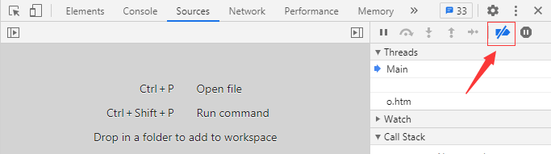
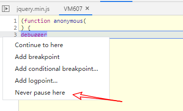
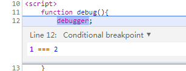
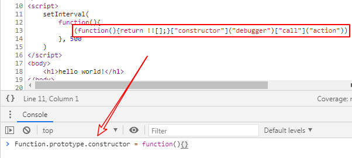
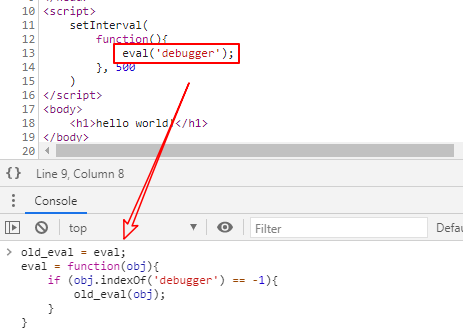
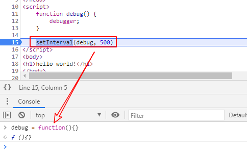

**无限 debugger**，非常烦人的一种 JS 反调试手段，但是这么叫并不是很准确，因为它并非是无限的，也不会写在 `while (true)` 中，否则还没等我们调试，浏览器就先卡死了。因此，它还有一个靓丽的名字：debugger 地狱！


## 实现 debugger 的方法

1. **不可混淆**
   
- `debugger`
  
2. **可混淆**
   - `eval('debugger')`
   - `eval(('regg'+'ubed').split('').reverse().join(''))`

3. **可重度混淆**

   ```javascript
   Function("debugger").call()/apply()
   
   XXX.constructor("debugger").call("action")
   
   Function.constructor("debugger").call("action")
   
   (function() {return !![];}["constructor"]("debugger")["call"]("action"))
   ```


## 处理无限 debugger

### (1) 禁用断点

属于伤敌一千，自损八百的招式，禁用后 debugger 虽然失效了，但同时我们也无法再下断点了




### (2) never pause here




### (3) add conditional breakpoints

右键选择 `add conditional breakpoints`，添加一个不可能成立的条件，例如：




### (4) 中间人工具修改代码逻辑

pass


### (5) 重写函数构造器




### (6) hook eval / setInterval




### (7) debugger前断点

在进入 debugger 前打上断点，随后 置空/重写 触发 debugger 的函数




